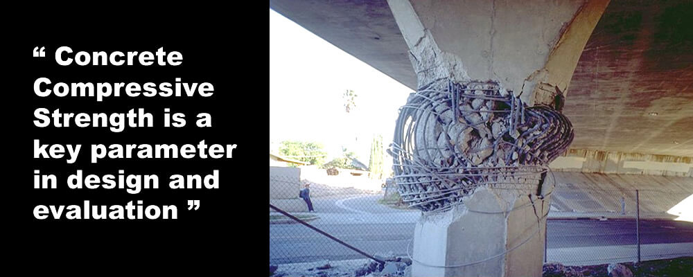
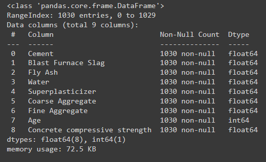
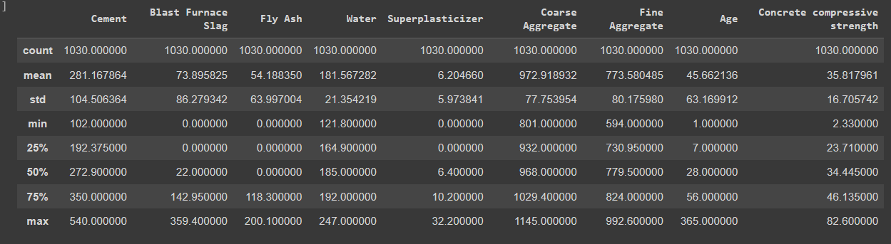
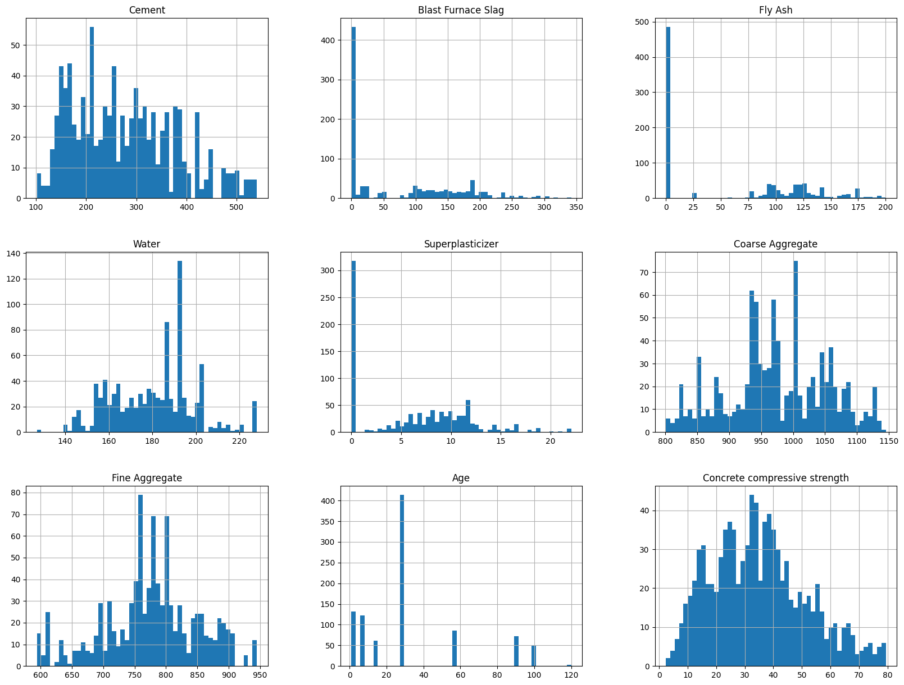
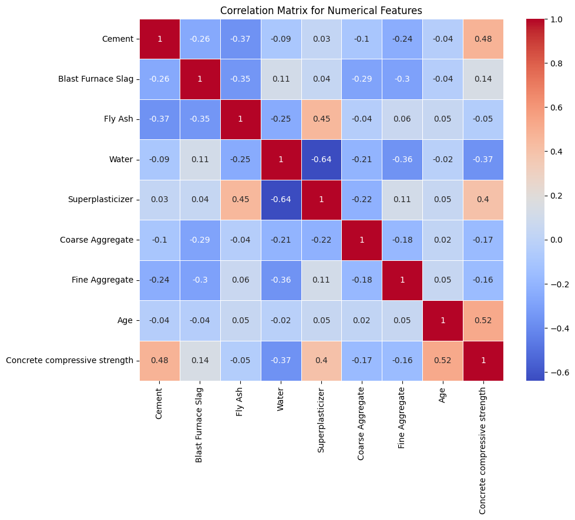
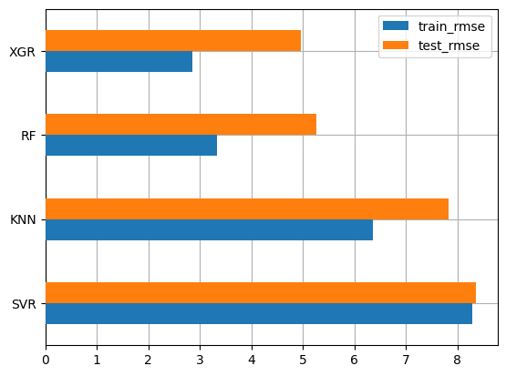
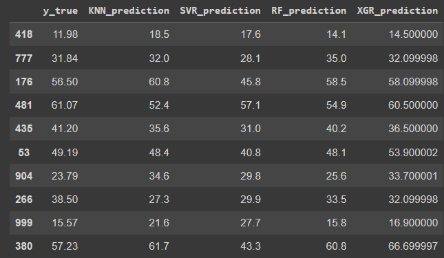

# Machine Learning Project Report - Axel Sean Cahyono Putra

# Concrete Compressive Strength
## Project Domain
"Concrete Compressive Strength" is a dataset title obtained from the UCI Machine Learning Repository. This dataset is suitable for beginners in the field of data science or machine learning. Due to its few features that are easy to understand, this dataset is suitable for learning for beginners.

According to [cor-tuf.com](https://cor-tuf.com/everything-you-need-to-know-about-concrete-strength/),  Concrete Compressive Strength is a unit used by engineers to measure the strength of concrete to withstand loads that can reduce the size of the concrete. Concrete compressive strength is tested by breaking concrete specimens in a special machine designed to measure this type of strength.

The compressive strength of concrete is very important because it is the main criterion for determining the performance of a building or structure. In the construction business, there are certainly some risks, and one of them is the risk of a building collapsing. One way to prevent this is by measuring the compressive strength of concrete because concrete is the main material in the construction process, so if there is an error in measuring the compressive strength of concrete, it will have a very big impact.

Therefore, this dataset can be used to predict the compressive strength of concrete before it can be used for construction purposes. In the dataset, there are train and test data containing components used in the mixture of concrete. By using regression, we can predict the strength of the concrete based on the component data and determine which components influence the compressive strength of concrete to reduce the risk of unsafe buildings.

## Business Understanding
### Problem Statement
- How to predict concrete compressive strength based on the components used in the mixture of concrete

### Goals
- Successfully predict concrete compressive strength using a machine learning model

### Solution Statement
- Using EDA to understand the nature of the data and determine the features that influence Concrete Compressive Strength
- Using several machine learning models to predict concrete compressive strength based on the given component data. The model that will be used is the regression model. Then the model with the smallest error will be chosen, several models that will be used are:
    1. K-Nearest Neighbors
    2. Support Vector Regressor
    3. Random Forest
    4. XGBoost Regressor

## Data Understanding
The Concrete Compressive Strength dataset can be downloaded from [this link](https://archive.ics.uci.edu/dataset/165/concrete+compressive+strength). In the dataset, there are 9 variables with 8 features and 1 target. Description of variables:
> the features in this dataset are components used in the mixture of concrete
- Cement (component 1): the amount of cement in the concrete mixture measured in kg in a cubic meter
- Blast Furnace Slag (component 2): the amount of slag from the blast furnace in the concrete mixture measured in kg in a cubic meter
- Fly Ash (component 3): the amount of fly ash in the concrete mixture measured in kg in a cubic meter
- Water (component 4): the amount of water in the concrete mixture measured in kg in a cubic meter
- Superplasticizer (component 5): the amount of superplasticizer in the concrete mixture measured in kg in a cubic meter
- Coarse Aggregate (component 6): the amount of coarse aggregate in the concrete mixture measured in kg in a cubic meter
- Fine Aggregate (component 7): the amount of fine aggregate in the concrete mixture measured in kg in a cubic meter
- Age: age of the concrete in days (1-365)
- Concrete compressive strength: the compressive strength of concrete measured in MPa (megapascal), is the target variable in the dataset

### Data Info
In the dataset, there are 1030 samples

  
  

Checking missing values 

  
Here it is assumed that features with a value of 0 mean that the component is not used in the process of mixing the concrete. So, those with a value of 0 will not be dropped.

### Visualisasi Data
- Univariate Analysis



It shows the amount of each component used in the mixing process, there are many 0 values in some features, the project continues with the assumption that components with a value of 0 are not used in the mixing process

- Multivariate Analysis



It can be seen that many features do not correlate with the target variable, but with this, it can be concluded that the dataset is **non-linear**.  
Water is not dropped because it is believed that water is also an important component in the mixing process of concrete.

## Data Preparation
Steps taken in Data Preparation:

- Split the feature variables and target variables so that the machine can differentiate which variables need to be used in training

    ```
    X = concrete_data.drop(['Concrete compressive strength'], axis=1)
    y = concrete_data['Concrete compressive strength']
    ```
- Split data into train and test

    ```
    from sklearn.model_selection import train_test_split

    X_train, X_test, y_train, y_test = train_test_split(X, y, test_size=0.2, random_state=69)
    ```
- Standardization: the process of transforming data so that it has the same scale, which is mean = 0 and variance = 1, this is necessary for machine learning algorithms to perform better when data has the same scale
    ```
    from sklearn.preprocessing import StandardScaler

    scaler = StandardScaler()
    scaler.fit(X_train)

    index, columns = X_train.index, X_train.columns

    X_train = scaler.fit_transform(X_train)
    X_train = pd.DataFrame(X_train, index=index, columns=columns)
    X_train.head()
    ```
    > it should be noted that in standardizing the dataset with all numerical features, there is a change from a dataframe to an np array. This can be prevented by changing it back to a dataframe as written in the code

## Modelling
Algorithm used:
1. **K-Nearest Neighbor**:
    * Pros: Easy to understand and implement, does not require complex learning or training.
    * Cons: Slow performance for large datasets, sensitive to unstandardized data, and requires choosing the right parameter K.
    * Parameters:
        - n_neighbors = number of nearest neighbors to be used for predicting the target value

2. **Support Vector Regressor (SVM)**:
    * Pros: Effective in datasets with many features, can handle non-linear data through kernels, and tends to be more tolerant to overfitting.
    * Cons: Requires tuning the right parameters, such as kernel and C, and is not efficient for very large datasets.
    * Parameters:
        - kernel = used to transform input data to a higher dimension.
        - rbf = kernel function useful for non-linear data.

3. **Random Forest**
    * Pros: Can handle unstructured data and unstandardized features, resistant to outliers and noise, and easy to use.
    * Cons: Possibility of overfitting on small datasets with highly diverse features, and difficult to interpret.
    * Parameters:
        - n_estimators = number of decision trees in the random forest, the more the more complex and computationally expensive the model is.
        - max_depth = maximum depth of each decision tree.
        - random_state = controls randomness in the model, if given a value then it will be randomly consistent.
        - n_jobs = number of jobs to be used in parallel for processing.

4. **Extreme Gradient Boosting (XGBRegressor)**:
    * Pros: Usually provides very good performance, tolerant to overfitting, and efficient in computational time.
    * Cons: Requires careful parameter tuning, and may require more computation processing compared to other models.
    * Parameters:
        - objective = objective function for modeling. the objective is squared error regression loss that fits our loss function.
        - n_estimators = number of decision trees in the ensemble model.
        - max_depth = maximum depth of each decision tree.
        - learning_rate = controls how big the learning step taken at each iteration.
        - subsample = Fraction of the dataset to be used for training each tree.
        - colsample_bytree = Fraction of features to be used in building each tree.

## Evaluation
The evaluation metric used is the loss function **root_mean_squared_error (RMSE)**, implementation in the code is as follows

```
from sklearn.metrics import mean_squared_error

def rmse(y_pred, y_true):
  return np.sqrt(mean_squared_error(y_pred=y_pred, y_true=y_true))
```

RMSE or Root Mean Squared Error is a loss function obtained from the process of squaring the error (y_actual - y_prediction) and dividing the sum by the number, then taking the square root.

Using this metric, we can train the model and determine how big the error is using the formula:


Where:
RMSE = root mean square error value
y = actual value
ŷ = predicted value
i = data sequence
n = number of data 

Here is the total loss of each model



It can be seen that the **XGBRegressor** model has the smallest loss among the four models. So, that model is the best among the other models.

Here are the prediction results of the four models

