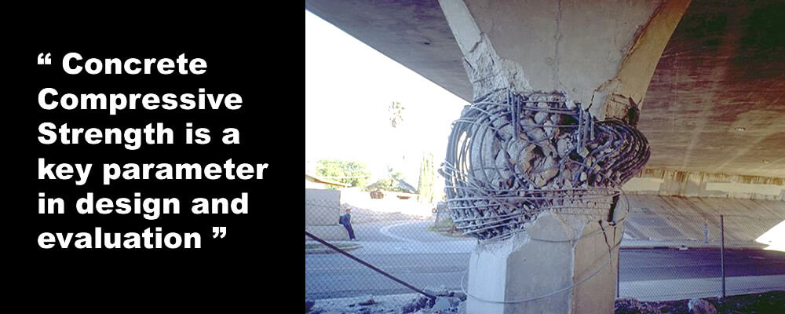
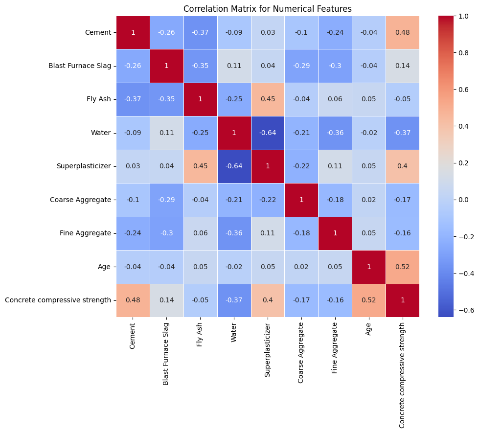

# Laporan Proyek Machine Learning - Axel Sean Cahyono Putra

# Concrete Compressive Strength
## Domain Proyek
Berdasarkan [[1]](#1-kenneth-a-tutu-david-a-odei-philip-baniba-michael-owusu-concrete-quality-issues-in-multistory-building-construction-in-ghana-cases-from-kumasi-metropolis-case-studies-in-construction-materials-vol-17-december-2022-e01425-httpswwwsciencedirectcomsciencearticlepiis2214509522005575) di Ghana, kejadian bangunan roboh merupakan hal yang sering terjadi dan banyak menimbulkan korban jiwa. Dalam tahun 2000 - 2020, sekitar 60 orang meninggal dunia dan 140 terluka dalam kasus 20 bangunan yang roboh. Bahkan di beberapa kota terbesar di Ghana masih terjadi fenomena bangunan roboh, diperkirakan hal itu terjadi karena penggunaan material bangunan yang berkualitas rendah terutama beton. Di Ghana pembuatan beton untuk bahan bangunan dibuat secara langsung di lokasi konstruksi, karena membeli beton yang siap dipakai memiliki biaya yang mahal. Kualitas dari beton yang sudah disiapkan terlebih dahulu tentu saja lebih bagus dikarenakan sesuai dengan parameter kualitas yang sudah ditentukan.

Bahan bangunan, terutama beton yang berkualitas rendah dipercaya menjadi sumber dari robohnya bangunan. Salah satu cara mengetahui kualitas dari beton adalah dengan menguji kekuatan tekan beton atau bisa disebut **Concrete Compressive Strength**. Kekuatan tekan beton bergantung pada komponen yang digunakan untuk proses pencampurannya. Jumlah semen, air, aggregate kasar, aggregate halus, dll. Merupakan faktor yang menentukan kekuatan tekan dari beton, namun terdapat faktor lain seperti temperatur, kelembapan udara, dan eksposur juga bisa mempengaruhi kekuatan dari beton. Oleh karena itu komposisi dan kondisi dari eksposur membuat proses prediksi menjadi kompleks [[2]](#2-gaoyang-liu-bochau-sun-concrete-compressive-strength-prediction-using-an-explainable-boosting-machine-model-case-studies-in-construction-materials-vol-18-july-2023-e01845-httpswwwsciencedirectcomsciencearticlepiis2214509523000244).

Oleh karena itu penggunaan model machine learning bisa melakukan prediksi kekuatan tekan dari beton berdasarkan data komponen yang digunakan dalam campuran beton tersebut. Karena satuan kekuatan beton merupakan nilai yang konstan maka model machine learning yang cocok adalah **Regresi**. Model regresi dapat menemukan pola dari dalam data yang berhubungan dengan kekuatan tekan beton (variabel output) dengan cara menganalisa jumlah komponen yang digunakan di tiap campuran beton dan menentukan campuran komponen apa dan jumlah sebanyak apa yang dapat mempengaruhi kekuatan tekan beton.

Model Regressi dapat diterapkan dengan beberapa tahapan yaitu: Pengumpulan Data, Persiapan Data, Pembagian Data, Pelatihan Model, Evaluasi Model. Setelah menjalankan tahapan itu, model dengan metrik evaluasi terbaik akan dipilih menjadi model untuk melakukan prediksi.

## Business Understanding
Seperti yang dijelaskan sebelumnya terkadang pembuatan campuran beton dilakukan di lokasi dengan minimnya alat untuk melakukan uji pada beton tersebut. Penggunaan model machine learning regresi dapat membantu dalam melakukan prediksi kekuatan tekan beton sebelum beton tersebut digunakan dalam proses pembangunan. Dengan begitu proses pembangunan bisa mengurangi pengeluaran berlebih dan juga menjamin keamanan bangunan yang akan dibangun. 

### Problem Statement
- Bagaimana cara prediksi kekuatan tekan beton berdasarkan data komponen yang digunakan dalam campuran suatu beton untuk meningkatkan efisiensi dan keamanan

### Goals
- Berhasil melakukan prediksi kekuatan tekan beton menggunakan model machine learning
- Berhasil mendapatkan model dengan error kurang dari 5%

### Solution Statement
- Menggunakan EDA untuk mengetahui sifat dari data dan mengetahui fitur yang berpengaruh terhadap Kekuatan Tekan Beton
- Menggunakan beberapa model machine learning untuk memprediksi kekuatan tekan beton berdasarkan data komponen yang diberikan. Model yang akan dipakai adalah model regresi. Kemudian model dengan error paling kecil yang akan dipilih, beberapa model yang akan digunakan adalah:
    1. K-Nearest Neighbors
    2. Suport Vector Regressor
    3. Random Forest
    4. XGBoost Regressor
- Memilih model dengan error terrendah untuk digunakan dalam prediksi kekuatan tekan beton

## Data Understanding
Dataset Concrete Compressive Strength dapat didownload melalui [link ini](https://archive.ics.uci.edu/dataset/165/concrete+compressive+strength). Dalam dataset terdapat 9 variabel dengan 8 fitur dan 1 target. Deskripsi variabel:
> fitur yang ada di dalam dataset ini merupakan komponen yang digunakan dalam campuran beton
- Cement (komponen 1): jumlah semen dalam campuran beton yang diukur dalam satuan kg dalam meter kubik
- Blast Furnace Slag (komponen 2): jumlah slag dari tanur tiup dalam campuran beton yang diukur dalam satuan kg dalam meter kubik
- Fly Ash (komponen 3): jumlah abu terbang dalam campuran beton yang diukur dalam satuan kg dalam meter kubik
- Water (komponen 4): jumlah air dalam campuran beton yang diukur dalam satuan kg dalam meter kubik
- Superplasticizer (komponen 5): jumlah superplastikizer dalam campuran beton yang diukur dalam satuan kg dalam meter kubik
- Coarse Aggregate (komponen 6): jumlah agregat kasar dalam campuran beton yang diukur dalam satuan kg dalam meter kubik
- Fine Aggregate (komponen 7): jumlah agregat halus dalam campuran beton yang diukur dalam satuan kg dalam meter kubik
- Age (Umur): umur beton dalam hari (1-365)
- Concrete compressive strength (Kekuatan Tekan Beton): kekuatan tekan beton yang diukur dalam satuan MPa (megapascal), merupakan target variabel dalam dataset

### Info Data
Dalam dataset terdapat 1030 sampel  

| idx | column                        | non-null count | dtype   |
|-----|-------------------------------|----------------|---------|
| 0   | Cement                        | 1030 non-null  | float64 |
| 1   | Blast Furnace Slag            | 1030 non-null  | float64 |
| 2   | Fly Ash                       | 1030 non-null  | float64 |
| 3   | Water                         | 1030 non-null  | float64 |
| 4   | Superplasticizer              | 1030 non-null  | float64 |
| 5   | Coarse Aggregate              | 1030 non-null  | float64 |
| 6   | Fine Aggregate                | 1030 non-null  | float64 |
| 7   | Age                           | 1030 non-null  | int64   |
| 8   | Concrete Compressive Strength | 1030 non-null  | float64 |
  

Mengecek nilai yang hilang  

|       |      Cement | Blast Furnace Slag |     Fly Ash |       Water | Superplasticizer | Coarse Aggregate | Fine Aggregate |         Age | Concrete compressive strength |
|------:|------------:|-------------------:|------------:|------------:|-----------------:|-----------------:|---------------:|------------:|------------------------------:|
| count | 1030.000000 | 1030.000000        | 1030.000000 | 1030.000000 | 1030.000000      | 1030.000000      | 1030.000000    | 1030.000000 | 1030.000000                   |
|  mean | 281.167864  | 73.895825          | 54.188350   | 181.567282  | 6.204660         | 972.918932       | 773.580485     | 45.662136   | 35.817961                     |
|  std  | 104.506364  | 86.279342          | 63.997004   | 21.354219   | 5.973841         | 77.753954        | 80.175980      | 63.169912   | 16.705742                     |
|  min  | 102.000000  | 0.000000           | 0.000000    | 121.800000  | 0.000000         | 801.000000       | 594.000000     | 1.000000    | 2.330000                      |
|  25%  | 192.375000  | 0.000000           | 0.000000    | 164.900000  | 0.000000         | 932.000000       | 730.950000     | 7.000000    | 23.710000                     |
|  50%  | 272.900000  | 22.000000          | 0.000000    | 185.000000  | 6.400000         | 968.000000       | 779.500000     | 28.000000   | 34.445000                     |
|  75%  | 350.000000  | 142.950000         | 118.300000  | 192.000000  | 10.200000        | 1029.400000      | 824.000000     | 56.000000   | 46.135000                     |
|  max  | 540.000000  | 359.400000         | 200.100000  | 247.000000  | 32.200000        | 1145.000000      | 992.600000     | 365.000000  | 82.600000                     |

Terlihat dalam beberapa komponen seperti *Blast Furnace Slag*, *Fly Ash*, *Superplasticizer* di bagian min (nilai minimal yang ada di dalam kolom tersebut) berisi nilai 0.
Biasanya nilai 0 akan dianggap sebagai *missing values* atau nilai yang hilang, Namun di proyek ini **nilai 0 akan diasumsikan bahwa komponen yang bernilai 0 artinya tidak digunakan dalam proses pencampuran**

### Visualisasi Data
- Univariate Analysis


Gambar 1. Univariate Analysis

Diperlihatkan jumlah tiap tiap komponen yang digunakan dalam proses pencampuran. Terlihat bahwa banyak nilai 0 dalam komponen *Blast Furnace Slag*, *Fly Ash*, *Superplasticizer*. Disini bisa disimpulkan bahwa ke 3 komponen tersebut jarang digunakan dalam proses pencampuran beton

- Multivariate Analysis


Gambar 2. Multivariate Analysis

Lihat baris paling bawah dari korelasi matriks, terihat komponen seperti semen dan umur memiliki korelasi yang tinggi dengan kekuatan tekan beton dan komponen seperti air tidak terlalu mempengaruhi kekuatan tekan beton, namun fitur *Water* tidak di-drop karena diyakini bahwa air juga merupakan komponen penting dalam proses pencampuran beton. 

Terlihat juga bahwa banyak fitur yang tidak berkorelasi dengan target variabel, namun dengan hal ini dapat disimpulkan bahwa dataset bersifat **non-linear**.

## Data Preparation
Tahapan yang dilakukan dalam Data Preparation:

- Handling outliers: mengatasi outliers menggunakan metode IQR, dengan menghilangkan outliers 1.5QR dibawah Q1 dan 1.5QR diatas Q3.
- Split variabel fitur dan variabel target, supaya mesin dapat membedakan variabel mana yang perlu digunakan dalam pelatihan.
- Split data menjadi train dan test dengan rasio 80:20 karena dataset relatif kecil, digunakan supaya model dapat melakukan evaluasi pada data baru dan mencegah overfitting.
- Standardization: proses mengubah data sehingga memiliki skala yang sama yaitu mean = 0 dan varians = 1, hal ini diperlukan algoritma machine learning memiliki performa lebih baik ketika data memiliki skala yang sama
    > perlu diperhatikan dalam standarisasi dataset dengan semua fitur numerical terjadi perubahan dari dataframe menjadi np array. dapat dicegah dengan mengubah lagi menjadi dataframe seperti yang dituliskan di kode

## Modelling
Tahapan dalam pemodelan yang dilakukan di tiap model:
1. Pengumpulan Data
2. Persiapan Data
3. Pembagian Data menjadi data latih dan data uji
4. Pelatihan Model
5. Evaluasi Model

Algoritma yang digunakan:
1. **K-Nearest Neighbor**: *KNN* adalah algoritma untuk melakukan klasifikasi pada objek berdasarkan data yang jaraknya paling dekat dengan objek tersebut. Algoritma ini digunakan karena memiliki sifat mudah digunakan.
    * Kelebihan: Mudah dipahami dan diimplementasikan, tidak memerlukan pembelajaran atau training yang kompleks.
    * Kelemahan: Kinerjanya lambat untuk dataset besar, sensitif terhadap data yang tidak terstandarisasi, dan perlu memilih parameter K yang tepat.
    * Parameter:
        - n_neighbors = jumlah tetangga terdekat yang akan digunakan untuk prediksi nilai target

2. **Support Vector Regressor (SVM)**: *SVM* adalah algoritma pencari hyperplane terbaik yang memisahkan 2 kelas dari ruang fitur. Pada kasus regresi algoritma ini mencari hyperplane dengan margin terbesar antara data. Algoritma ini digunakan karena cocok untuk mengatasi dataset non-linear melalui parameter "kernel".
    * Kelebihan: Efektif dalam dataset dengan banyak fitur, dapat menangani data non-linear melalui kernel, dan cenderung lebih toleran terhadap overfitting.
    * Kelemahan: Memerlukan tuning parameter yang tepat, seperti kernel dan C, serta tidak efisien untuk dataset sangat besar.
    * Parameter:
        - kernel = digunakan untuk mengubah data input ke dimensi yang lebih tinggi.
        - rbf = fungsi kernel yang berguna untuk data non-linear (argumen dari parameter kernel).

3. **Random Forest**: *RF* adalah algoritma yang terdiri dari banyak pohon keputusan yang dihasilkan secara acak, kemudian rata-rata dari hasil akhir tiap pohon akan digunakan untuk prediksi. Algoritma ini digunakan karena kemampuannya dalam menangani data non-linear dan dapat memberikan hasil yang stabil. 
    * Kelebihan: Dapat menangani data yang tidak terstruktur dan fitur-fitur yang tidak terstandarisasi, tahan terhadap outliers dan noise, serta mudah digunakan.
    * Kelemahan: Kemungkinan overfitting pada dataset kecil dengan fitur-fitur yang sangat beragam, serta sulit untuk diinterpretasi.
    * Parameter:
        - n_estimators = jumlah pohon keputusan dalam random forest, makin banyak makin kompleks dan komputasinya mahal.
        - max_depth = kedalaman maksimum tiap pohon keputusan.
        - random_state = mengontrol randomness dalam model, jika diberi nilai maka akan dirandom secara konsisten.
        - n_jobs = jumlah pekerjaan yang akan digunakan secara paralel untuk pemrosesan.

4. **Extreme Gradient Boosting (XGBRegressor)**: *XGBRegressor* adalah implementasi dari algoritma gradient boosting yang menggabungkan beberapa model lemah (weak learner) dan menambahkan wear learner baru pada tiap iterasi dengan tujuan memperbaiki hasil prediksi sebelumnya. Algoritma ini digunakan karena dapat memberi performa yang baik dalam memprediksi nilai target
    * Kelebihan: Biasanya memberikan performa yang sangat baik, toleran terhadap overfitting, dan efisien dalam waktu komputasi.
    * Kelemahan: Memerlukan penyetelan parameter yang cermat, serta dapat memerlukan lebih banyak pemrosesan komputasi dibandingkan dengan model lainnya.
    * Parameter:
        - objective = fungsi tujuan untuk pemodelan. tujuannya adalah squared error regression loss yang cocok dengan loss function.
        - n_estimators = jumlah pohon keputusan dalam model ensemble.
        - max_depth = kedalaman maksimum tiap pohon keputusan.
        - learning_rate = mengontrol seberapa besar langkah pembelajaran yang diambil pada setiap iterasi.
        - subsample = Fraksi dari dataset yang akan digunakan untuk pelatihan setiap pohon.
        - colsample_bytree = Fraksi dari fitur yang akan digunakan dalam pembentukan setiap pohon. 

## Evaluation
Metrik evaluasi yang digunakan yaitu loss function **root_mean_squared_error (RMSE)**, implementasinya pada kode berikut

```
from sklearn.metrics import mean_squared_error

def rmse(y_pred, y_true):
  return np.sqrt(mean_squared_error(y_pred=y_pred, y_true=y_true))
```

RMSE atau Root Mean Squared Error adalah loss function yang didapat dari proses mengkuadratkan error (y_asli - y_prediksi) dan dibagi jumlah yang menjadi rata-rata lalu di akarkan

Dengan menggunakan metrik ini, model dapat dilatih dan error yang didapat dapat diukur menggunakan formula:

RMSE = $\displaystyle \left(\frac{\sum (y_i - \hat{y}_i)}{n}\right)^{1/2}$

Dimana:  
RMSE = nilai root mean square error  
y  = nilai aktual  
ŷ  = nilai hasil prediksi  
i  = urutan data   
n  = jumlah data  

Berikut adalah jumlah loss dari tiap model

| model | train_rmse | test_rmse |
|------:|-----------:|----------:|
|  KNN  | 6.356479   | 7.825455  |
|  SVR  | 8.290605   | 8.360327  |
|   RF  | 3.329867   | 5.268821  |
|  XGR  | 2.857279   | 4.971411  |

Berikut plot loss dari tiap model


Gambar 3. Plot Loss Model

Terlihat bahwa model XGBRegressor memiliki jumlah loss paling kecil diantara ke-empat model. Sehingga model itulah yang terbaik dari model lainnya.

Berikut adalah hasil prediksi dari ke empat model

|  id | y_true | KNN_prediction | SVR_prediction | RF_prediction | XGR_prediction |
|----:|-------:|---------------:|---------------:|--------------:|---------------:|
| 418 | 11.98  | 18.5           | 17.6           | 14.1          | 14.500000      |
| 777 | 31.84  | 32.0           | 28.1           | 35.0          | 32.099998      |
| 176 | 56.50  | 60.8           | 45.8           | 58.5          | 58.099998      |
| 481 | 61.07  | 52.4           | 57.1           | 54.9          | 60.500000      |
| 435 | 41.20  | 35.6           | 31.0           | 40.2          | 36.500000      |
|  53 | 49.19  | 48.4           | 40.8           | 48.1          | 53.900002      |
| 904 | 23.79  | 34.6           | 29.8           | 25.6          | 33.700001      |
| 266 | 38.50  | 27.3           | 29.9           | 33.5          | 32.099998      |
| 999 | 15.57  | 21.6           | 27.7           | 15.8          | 16.900000      |
| 380 | 57.23  | 61.7           | 43.3           | 60.8          | 66.699997      |

Berdasarkan data tersebut dapat diketahui bahwa model regresi dapat melakukan prediksi kekuatan tekan beton berdasarkan data komponen yang diberikan. Dan didapatkan model dengan error kurang dari 5% yaitu model *XGBRegressor*. Terlihat juga bahwa hasil prediksi dari model *XGBRegressor* sudah mendekati nilai aktual meskipun terkadang meleset sedikit.

Proyek ini masih perlu perbaikan terutama dibagian modelling, untuk model *XGBRegressor* bisa dilakukan hyperparameter tuning supaya bisa mendapatkan error yang lebih kecil untuk dapat memprediksi kekuatan tekan beton dengan error sekecil mungkin.

# Conclusion
Dalam evaluasi model, hasil metrik evaluasi menunjukkan bahwa model *XGBRegressor* memberikan hasil paling baik yaitu dengan error *RMSE* pada data uji sebesar 4.97. Hal ini menunjukkan bahwa model *XGBRegressor* dapat melakukan prediksi kekuatan tekan beton dengan error yang rendah dibawah 5% nilai aktual.

Hasil prediksi model lain seperti *Random Forest* juga memberikan error yang relatif kecil dibandingkan model *KNN* dan *Support Vector Regressor* yang sedikit lebih besar dari model lainnya. Meskipun demikian semua model mampu memberikan prediksi yang bagus dalam memprediksi kekuatan tekan beton.

Proyek ini telah berhasil mencapai tujuan yang ditetapkan yaitu memprediksi kekuatan tekan beton menggunakan model machine learning. Tetapi perlu dilakukan hyperparameter tuning pada model XGBRegressor untuk dapat mencapai nilai error yang lebih kecil lagi demi memberikan prediksi yang dapat diandalkan.

# References
##### [1] Kenneth A. Tutu, David A. Odei, Philip Baniba, Michael Owusu, "Concrete quality issues in multistory building construction in Ghana: Cases from Kumasi metropolis," *Case Studies in Construction Materials, Vol 17, December 2022, e01425* https://www.sciencedirect.com/science/article/pii/S2214509522005575
##### [2] Gaoyang Liu, Bochau Sun, "Concrete compressive strength prediction using an explainable boosting machine model," *Case Studies in Construction Materials, Vol 18, July 2023, e01845* https://www.sciencedirect.com/science/article/pii/S2214509523000244